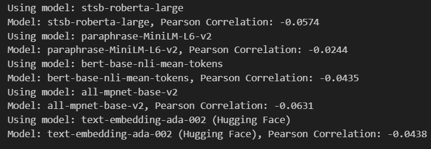

# Natural Language Processing Work
## [Assignment 1](./Assignment%201/README.md)

## [Assignment 2](./Assignment%202/README.md)

## [Seminar Research](./Seminar%20Paper/Paper%20Presentation%20-%20Group%202.pdf)
Given the rising popularity of social media, there is a risk of negative impacts such as cyberbullying, causing mental health distress to some users. As a result, we dived into an exploration of depression detection with the **DORIS framework** proposed by Lan X., Cheng Y., Sheng L., Gao C., and Li Y. It also forms a basis for our project which aims to perform a NLP-based model targetting suicide detection.

## [Project](./Project/CSI5386_Natural_Language_Processing_Project_Proposal.pdf)
Our project analyzes suicidal intentions from popular social media platforms, and trains the best model for suicidal detection. Here are the models that we've used. 

### Fine-Tuning a Deep Learning based Transformer - DistilBERT

## Execution Guide
* [**TMUX**](tmux.md) for idling long executions
